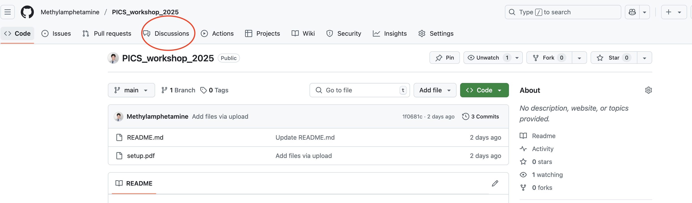

# PICS_workshop_2025

This repo contains the file for PICS python workshop in April 10th, 2025

## Important Note

In this workshop, all tutorials are just for education purpose so they are not rigorously examed for correctness. If you are stuck by using any part of the tutorials, do not spend hours debugging and post a thread in the discussion section for this repo instead.

If you intend to use the content for research, please check the official implementations such as `torch.nn.TransformerEncoderLayer`, `torch.nn.TransformerEncoder` and `neuralop.models.FNO` since they have been rigorously proven by thousands of resesarchers and offer more customization for you.

## Dataset files

Under unforseeable event of `the_well` dataset used being unable to be downloaded, please use [this link](https://drive.google.com/drive/folders/1wycV4RiSIrtG7X_ZXgZ7Irq62Sv7YoWe?usp=sharing) and put the shared directory into your Google Drive's root directory.

You can access your Google Drive in Colab too.
